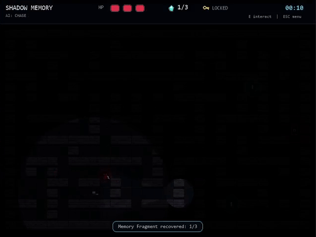
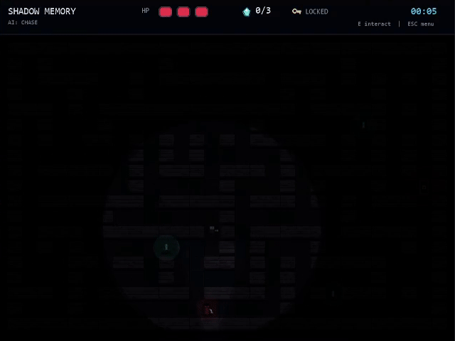

An atmospheric, 2D top-down horror-puzzle game built from scratch in Python using the Pygame framework. It runs completely self-contained with zero external asset dependencies, generating all pixel art, lighting masks, and user interfaces programmatically at runtime.

<p align="center">
  
</p>

## Key Features & AI Architecture

* **Finite State Machine (FSM):** The enemy AI switches dynamically between four tactical states: `PATROL`, `CHASE`, `RANGED ATTACK`, and `MELEE STAB`.
* **A* Pathfinding:** Built-in optimized $A^*$ algorithm utilizing a **Manhattan Distance** heuristic for intelligent, real-time maze navigation.
* **Procedural Maze Generation:** Generates unique maze layouts automatically and uses a pre-run validation check to ensure every map is 100% solvable.
* **Dynamic Lighting:** Real-time visual fog-of-war effect simulating a claustrophobic flashlight cone centered around the player.
* **Self-Contained Logic:** Built entirely with pure Python and Pygame standard geometric libraries—no cloud pipelines or API calls.

<p align="center">
  
</p>

## Controls

* **Move:** `W` `A` `S` `D` / Arrow Keys
* **Interact (Artifacts / Exit):** `E`
* **Menu Navigation / Cancel:** `ESC` or `ENTER`

Ensure you have Python installed, then set up the required dependencies and run the script:

```bash
# Install Pygame (tested on python 3.13)
pip install pygame

# Run the game
python shadow_memory.py
